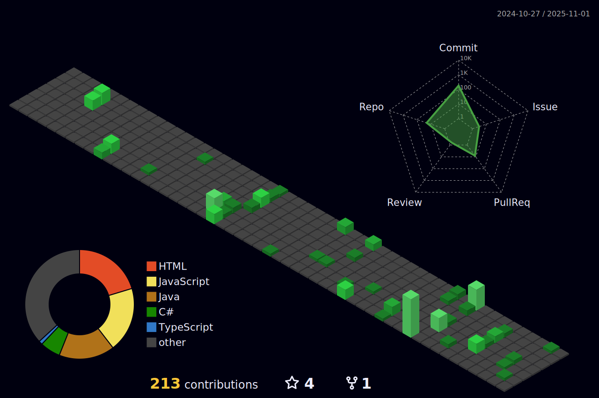

# Hello there, I'm Luccas :wave:

## I'm a Power Platform & Dynamics 365 Developer and a Student!!

Senior Developer | Specialist in Power Platform & Dynamics 365 | Certified Power Platform Functional Consultant [PL-200] | Business Solutions Expert

🔭 Committed to continuously improving my development skills and problem-solving abilities, aiming to deliver efficient technological solutions.

🌱 Enhancing my knowledge in Microsoft Power Platform, Dynamics 365, .NET, ASP.NET MVC, Node.js, Microsoft SQL Server, and Azure to deliver integrated and scalable solutions.

💻 At Smart Consulting, I contribute to improving the efficiency and quality of our clients' projects. I have experience in adapting and configuring Dynamics 365 business applications, with a focus on Project Operations (project and finance operations), Customer Service (customer support), and Dynamics 365 Sales.

🏫 Pursuing a Bachelor's degree in Information Systems at UFOP (Federal University of Ouro Preto)

 

## 📊 GitHub Stats

  &nbsp;&nbsp;&nbsp;&nbsp;&nbsp;&nbsp;
  

## 🛠 Skills:

### I have experience

### I'm familiar with

  

  
  
  
  

 

## Connect with me: :iphone:

## 🚀 Highlighted Repositories

	
  	
  	

### Github Stats:
|  |  |
| :-----------------------------------------------------------------------------------------------------------------------------------------------------------------------------------------------------: | :--------------------------------------------------------------------------------------------------------------------------------------------------------------------------------------: |
|                                                                                      |     |

<!-- <h4 align="center">My contribution graph</h4>

  
 
-->

<h4 align="center">Watch my contribution graph get eaten by the snake 🐍</h4>

  
 

<h4 align="center">Isometric view of contributions in the last year.</h4>
	  

	

 

  

